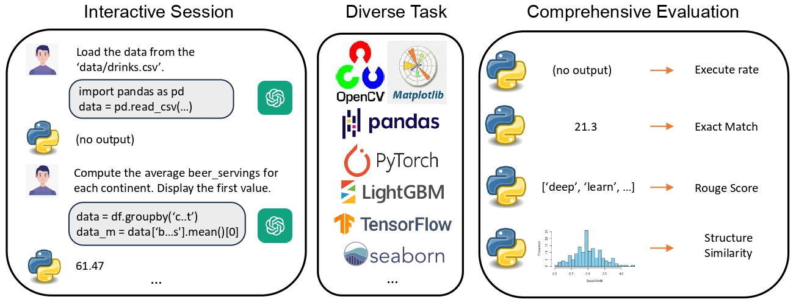
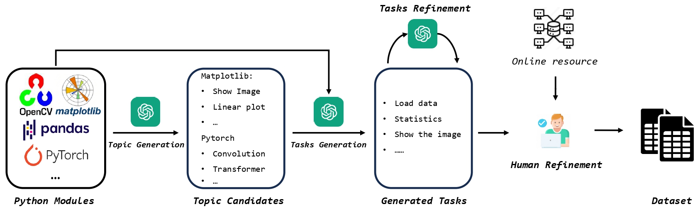
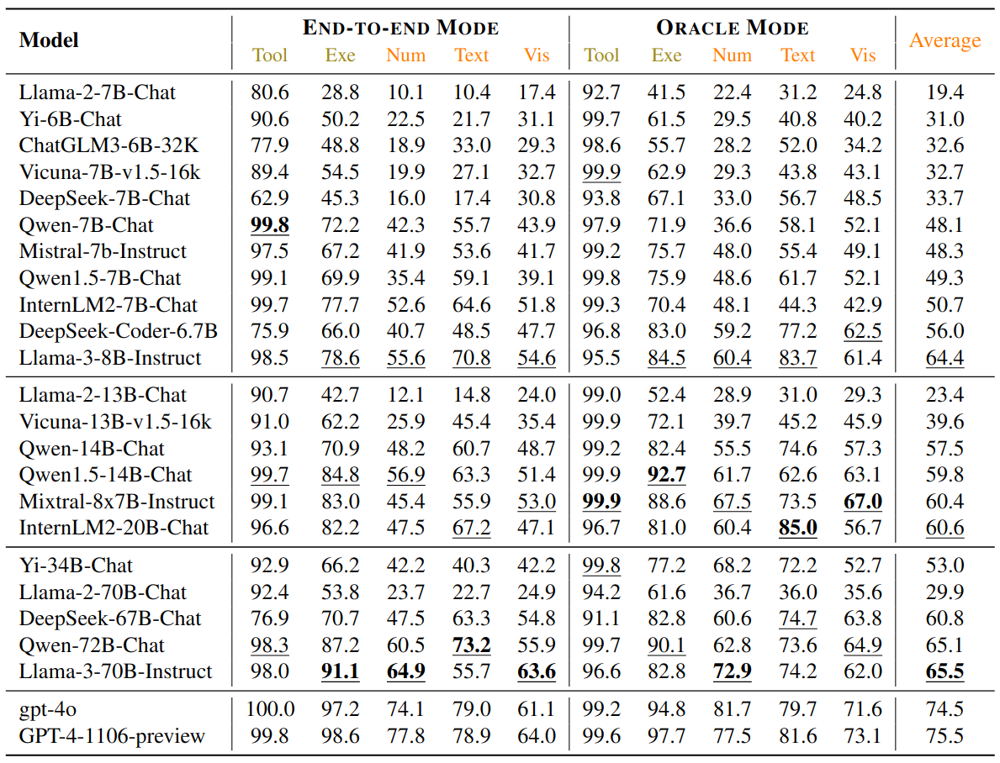

# CIBench: Evaluating Your LLMs with a Code Interpreter Plugin

[](https://arxiv.org/abs/2312.14033)
[](./LICENSE)

## ✨ Introduction  

This is an evaluation harness for the benchmark described in [CIBench: Evaluating Your LLMs with a Code Interpreter Plugin](https://arxiv.org/abs/2312.14033). 

[[Paper](https://arxiv.org/abs/2312.14033)]
[[Project Page](https://open-compass.github.io/CIBench/)]
[[LeaderBoard](https://open-compass.github.io/CIBench/leaderboard.html)]
[[HuggingFace](https://huggingface.co/datasets/lovesnowbest/CIBench)]

> While LLM-Based agents, which use external tools to solve complex problems, have made significant progress, benchmarking their ability is challenging, thereby hindering a clear understanding of their limitations. In this paper, we propose an interactive evaluation framework, named CIBench, to comprehensively assess LLMs' ability to utilize code interpreters for data science tasks. Our evaluation framework includes an evaluation dataset and two evaluation modes. The evaluation dataset is constructed using an LLM-human cooperative approach and simulates an authentic workflow by leveraging consecutive and interactive IPython sessions. The two evaluation modes assess LLMs' ability with and without human assistance. We conduct extensive experiments to analyze the ability of 24 LLMs on CIBench and provide valuable insights for future LLMs in code interpreter utilization.

<!-- <div>
<center>

</div> -->

<div>
<center>

</div>


## 🛠️ Preparations
CIBench is evaluated based on [OpenCompass](https://github.com/open-compass/opencompass). Please first install opencompass. 

```bash
conda create --name opencompass python=3.10 pytorch torchvision pytorch-cuda -c nvidia -c pytorch -y
conda activate opencompass
git clone https://github.com/open-compass/opencompass opencompass
cd opencompass
pip install -e .
pip install requirements/agent.txt
```

Then, 

```bash
cd ..
git clone https://github.com/open-compass/CIBench.git
cd CIBench
```

move the *cibench_eval* to the *opencompass/config*
<!-- ##  🛫️ Get Started

We support both API-based models and HuggingFace models via [Lagent](https://github.com/InternLM/lagent). -->

### 💾 Test Data

You can download the CIBench from [here](https://github.com/open-compass/opencompass/releases/download/0.2.4.rc1/cibench_dataset.zip). 

Then, unzip the dataset and place the dataset in *OpenCompass/data*. The data path should be like *OpenCompass/data/cibench_dataset/cibench_{generation or template}*. 

Finally, using the following scripts to download the nessceary data.

```bash
cd OpenCompass/data/cibench_dataset
sh collect_datasources.sh
```

<!-- The data file structure is:
```bash
opencompass
--- data
--- --- cibench_dataset
--- --- --- cibench_generation
--- --- --- cibench_template
--- --- --- cibench_template_chinese
--- --- --- collect_datasources.sh
``` -->


<!-- ### 🤖 API Models

1. Set your OPENAI key in your environment.
```bash
export OPENAI_API_KEY=xxxxxxxxx
```
2. Run the model with the following scripts
```bash
# test all data at once
sh test_all_en.sh api gpt-4-1106-preview gpt4
# test ZH dataset
sh test_all_zh.sh api gpt-4-1106-preview gpt4
# test for Instruct only
python test.py --model_type api --model_path gpt-4-1106-preview --resume --out_name instruct_gpt4.json --out_dir work_dirs/gpt4/ --dataset_path data/instruct_v2.json --eval instruct --prompt_type json -->
<!-- ``` -->

### 🤗 HuggingFace Models

1. Download the huggingface model to your local path.
<!-- 2. Uncomment or comment the model in *opencompass/config/cibench_eval/model_collections/chat_models.py*. -->
2. Run the model with the following scripts in the opencompass dir.
```bash
python run.py config/cibench_eval/eval_cibench_hf.py
```

<!-- Note: You can install [lmdeploy](https://github.com/InternLM/lmdeploy) and add '-a lmdeploy' to acclerate the evaluation. -->
### 💫 Final Results
Once you finish all tested samples, you can check the results in *outputs/cibench*. 

Note that the output images will be saved in *output_images*.

## 📊 Benchmark Results

More detailed and comprehensive benchmark results can refer to 🏆 [CIBench official leaderboard](https://open-compass.github.io/CIBench/leaderboard.html) !

<div>
<center>

</div>

<!-- ### ✉️ Submit Your Results

You can submit your inference results (via running test.py) to this [email](lovesnow@mail.ustc.edu.cn). We will run your predictions and update the results in our leaderboard. Please also provide the scale of your tested model. A sample structure of your submission should be like:
```
$model_display_name/
    instruct_$model_display_name/
        query_0_1_0.json
        query_0_1_1.json
        ...
    plan_json_$model_display_name/
    plan_str_$model_display_name/
    ...
``` -->

## ❤️ Acknowledgements

CIBench is built with [Lagent](https://github.com/InternLM/lagent) and [OpenCompass](https://github.com/open-compass/opencompass). Thanks for their awesome work!

<!-- ## 🖊️ Citation

If you find this project useful in your research, please consider cite:
```
@article{chen2023t,
  title={CIBench: Evaluating Your LLMs with a Code Interpreter Plugin},
  author={Chuyu Zhang*, Yingfan Hu*, Songyang Zhang, Kuikun Liu, Zerun Ma, Fengzhe Zhou1, Wenwei Zhang, Xuming He, Dahua Lin, Kai Chen},
  journal={arXiv preprint arXiv:2312.14033},
  year={2023}
}
``` -->

## 💳 License

This project is released under the Apache 2.0 [license](./LICENSE).